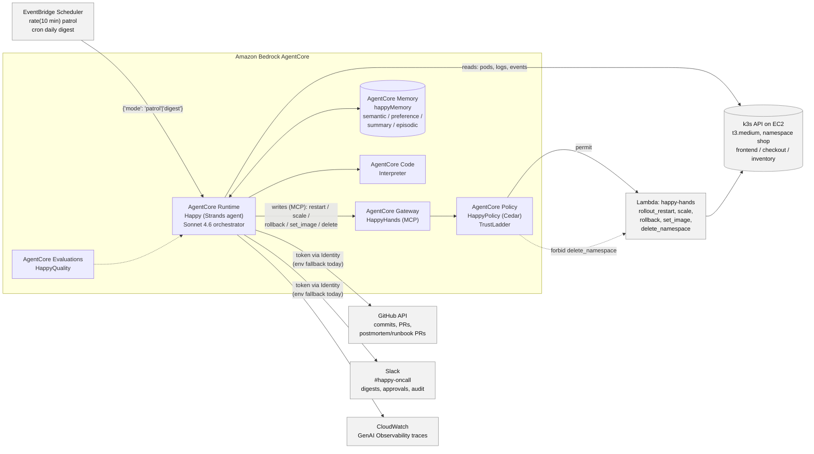
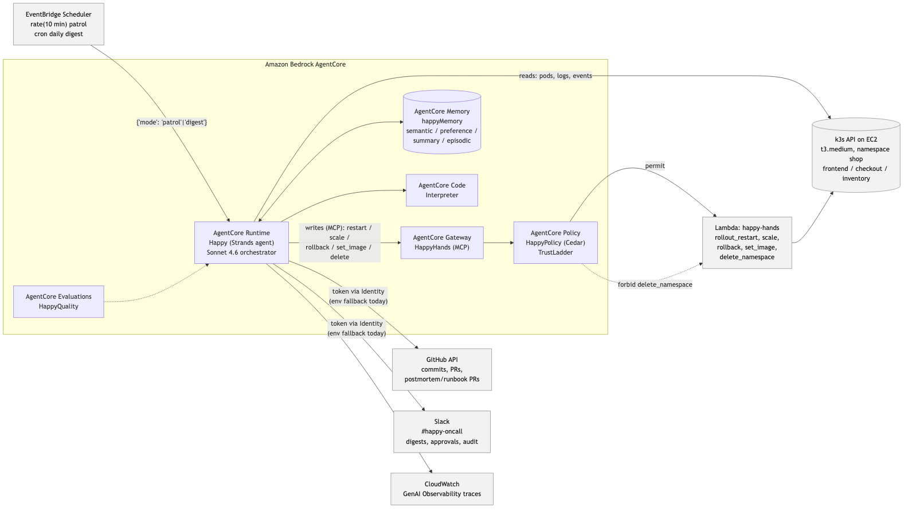

# Happy

**The on-call junior who never sleeps and never touches prod without asking.**

Built for the AWS "Agents for Humans" hackathon, Professional Agents track.

## What it is

Happy is a background agent that watches a Kubernetes cluster on a schedule and does the
routine parts of on-call: checking what broke, working out why, fixing the safe things itself,
and asking a human before anything risky. It is built with the [Strands Agents
SDK](https://strandsagents.com) and deployed on [Amazon Bedrock
AgentCore](https://aws.amazon.com/bedrock/agentcore/), so its "no" — the things it must never do
— lives outside the model, enforced by an AgentCore Policy at the Gateway rather than by a
prompt. You never open a dashboard for it; it lives in Slack, stays silent when things are
healthy, and gets better at diagnosing repeat failures over time without ever getting more
reckless about them.

## The problem

On-call engineers lose their day to small, repeated checks: what broke, why, did the last
deploy cause it, should we roll back, who needs to know. Each check takes five minutes. Together
they eat the day and crowd out the judgment calls that actually need a human.

## A day with Happy

**9:00, the morning digest.** Happy posts to `#happy-oncall`: what broke overnight, what it
fixed on its own, what's waiting on a human, which pull requests are open, and anything worth
recalling from memory — "checkout ran out of memory again, third time this week."

**Every 10 minutes, the patrol.** Happy checks every deployment in the watched namespace.
Healthy means it posts nothing — silence is the feature. Unhealthy means it investigates: pulls
logs and events, fingerprints the failure, checks whether it has seen this signature before, and
either proposes the fix that worked last time or spins up a small team of specialists to work
out what happened from scratch.

**The trust ladder.** Every fix Happy can make sits on one of three tiers. **SAFE** — like
restarting a stuck pod — it just does, and tells you afterwards. **APPROVAL** — like rolling
back a deployment — it pauses, posts the proposed action in Slack, and waits for a human to
reply `approve` or `deny`. If you reply after Happy itself has restarted, it resumes exactly
where it left off. **FORBIDDEN** — like deleting a namespace — it cannot do at all: the
call is rejected by an AWS policy engine before it ever reaches the cluster, whether or not the
model "wants" to make it.

**The learning loop.** Every incident gets a signature built from the shape of its errors, not
its timestamps or pod names, so the same failure is recognized on a second occurrence even
though nothing on the surface matches. Recognized incidents come with the fix that worked before
and how long it took — Happy still asks before applying it. Outcomes are recorded either way, so
a fix that failed once isn't proposed with confidence again, and a denial with a reason becomes
a standing preference for next time.

**Postmortems and runbooks.** Once an incident is resolved, Happy opens a pull request with a
postmortem: timeline, root cause, resolution, follow-ups. Once the same fix has worked twice for
the same signature, it opens a second pull request with a runbook page — so what Happy learned
doesn't stay locked inside the agent, it lands in the team's repo where anyone can read it.

## Architecture

A Strands agent, deployed on Amazon Bedrock AgentCore Runtime via the AgentCore CLI, is invoked
on a schedule by EventBridge Scheduler with a payload like `{"mode": "patrol"}`. It reads the
cluster directly through the Kubernetes API, but every write that touches the cluster goes
through an AgentCore Gateway (an MCP target backed by a Lambda) governed by an AgentCore Policy
engine evaluating Cedar rules. It reads git history from GitHub and talks to humans through
Slack. AgentCore Memory gives it recall across runs; the log-analysis specialist uses AgentCore
Code Interpreter to run real analysis code instead of eyeballing a few lines. CloudWatch records
every run as a trace and AgentCore Evaluations scores it.





Models: Claude Sonnet 4.6 (`us.anthropic.claude-sonnet-4-6`) as the orchestrator and the
investigation synthesizer; Claude Sonnet 4.5 (`global.anthropic.claude-sonnet-4-5-20250929-v1:0`)
for the three parallel investigation specialists — cheaper and fast enough for reading logs and
events, with the more capable model reserved for the calls that write a report or decide what
to do.

### What each feature is for

**Strands features**

| Feature | Where | Why it is natural |
|---|---|---|
| `@tool` functions | k8s reads, GitHub, Slack | Happy's eyes and voice |
| Hooks (`BeforeToolCallEvent`, `AfterToolCallEvent`) | `guardrails.py` | Audit log; local-only policy fallback |
| Interrupts (`tool_context.interrupt`) | risky write tools | Pause for Slack approval, resume later, even after a restart |
| Session management | `memory.py` | A pending approval survives the agent restarting mid-wait |
| `SummarizingConversationManager` | `agent.py` | Long investigations stay within context without losing evidence |
| Graph multi-agent | `investigate.py` | Three investigators work in parallel, one synthesizes |
| Structured output (Pydantic) | `models.py` | Reports are data, so Slack formatting and audit stay reliable |
| Per-node model providers | `investigate.py` | Sonnet 4.5 specialists, Sonnet 4.6 synthesizer |
| MCP client → AgentCore Gateway | `tools/hands.py` | Cluster writes are governed tools, not agent code |
| OpenTelemetry tracing | SDK default | Every run becomes a CloudWatch trace |

**AgentCore services**

| Service | Where | Why it is natural |
|---|---|---|
| Runtime | `main.py`, `agentcore deploy` | Hosts Happy; async ack lets Scheduler get an instant reply while the investigation keeps running |
| Memory | `memory.py`, `ledger.py` | Recall across days: incident summaries, preferences, semantic facts, episodes |
| Gateway | `tools/hands.py` | Cluster writes are MCP tools behind a governed boundary |
| Policy (Cedar) | `policies/*.cedar` | Forbid `delete_namespace`; cap scaling at 5 replicas — enforced outside the model |
| Identity | `tools/slack.py`, `tools/github.py` | Slack/GitHub tokens fetched at run time, never held in env vars (planned; env fallback is what runs today) |
| Code Interpreter | `investigate.py` logs specialist | Runs real analysis (pandas) over thousands of log lines in a sandbox |
| Observability | CloudWatch traces | The agent that watches your cluster is itself watched |
| Evaluations (`HappyQuality`) | `onlineEvalConfigs` in `agentcore.json` | Built-in evaluators score tool-selection accuracy and helpfulness on every run |

Surrounding AWS: EventBridge Scheduler triggers patrol and digest runs; a Lambda is the Gateway's
only compute target for cluster writes.

## Trust ladder

Five tools can change the cluster. Each sits on exactly one tier, defined once in
`app/happy/guardrails.py::TIERS` and mirrored in the Gateway's tool schema
(`app/hands/tools.json`) and Cedar policy (`policies/*.cedar`).

| Tool | Tier | Enforced by |
|---|---|---|
| `rollout_restart` | SAFE | AgentCore Policy (Cedar `permit`s it unconditionally at the Gateway); no interrupt |
| `scale_deployment` | SAFE ≤ 5 replicas, APPROVAL above | Both — a Strands interrupt asks a human above 5 replicas, and Cedar's `when { replicas <= 5 }` denies anything larger at the Gateway regardless of that approval |
| `rollback_deployment` | APPROVAL | Strands interrupt (waits for a Slack `approve <id>`); permitted at the Gateway once called |
| `set_image` | APPROVAL | Strands interrupt (waits for a Slack `approve <id>`); permitted at the Gateway once called |
| `delete_namespace` | FORBIDDEN | AgentCore Policy (Cedar `forbid`) at the Gateway — the call never reaches Kubernetes; `PolicyHook` blocks it in-process too, as a local fallback if the Gateway is absent |

Approving an action once does not make the next one automatic — there is no tier a repeated
"approve" ever promotes a tool to. Humans stay in the loop by design; see [the trust-ladder blog
post](docs/blog/02-trust-ladder.md) for why that boundary is deliberately outside the model.

## How Happy learns

1. **Fingerprint** (`fingerprint.py`) — strip timestamps, ids, IPs and pod-name suffixes from
   error-ish log lines, keep the shape, count the most frequent shapes, and hash service +
   namespace + failure reason + those shapes into a short id. Same failure, same id, even with
   different pod names and times.
2. **Ledger** (`ledger.py`) — on every patrol, the fingerprint is looked up against an incident
   ledger (exact id match first, then signature overlap) backed by AgentCore Memory. A repeat
   increments a counter on the existing record instead of creating a duplicate.
3. **Outcomes** — after a fix executes, Happy verifies recovery and records success or failure
   against the record. A fix that failed isn't proposed with confidence next time.
4. **Preferences** — a Slack denial that comes with a reason ("don't roll back checkout during
   business hours") is stored as a preference and shapes future proposals for that service.
5. **Runbook** — once the same action has succeeded twice for one signature, Happy opens a pull
   request with a runbook page: symptom, signature, likely causes, fix steps, verify steps. The
   knowledge leaves the agent and lands in the repo.

## Run it yourself

**Prerequisites:** an AWS account with Bedrock model access in `us-east-1`, the AWS CLI
configured, Python 3.12 and [`uv`](https://docs.astral.sh/uv/), Node (for `npm i -g
@aws/agentcore`), a Slack app, and a GitHub token for this repo.

### 1. Stand up the demo cluster

```bash
infra/ec2-k3s/launch.sh              # one t3.medium in the default VPC, k3s installed by user-data
infra/ec2-k3s/fetch-kubeconfig.sh    # writes ~/.kube/happy.yaml and KUBECONFIG_B64 into .env
kubectl --kubeconfig ~/.kube/happy.yaml apply -f infra/k8s
```

This gives you namespace `shop` with `frontend`, `checkout` and `inventory` — plain
`python:3.12-slim` deployments with a ConfigMap-mounted HTTP server, so nothing is built or
pushed.

### 2. Configure and test locally

```bash
cp .env.example .env               # fill in SLACK_BOT_TOKEN, SLACK_CHANNEL_ID, GITHUB_TOKEN
cd app/happy && uv sync --extra dev
uv run pytest
```

```bash
uv run happy patrol      # checks the cluster once; silent if healthy
uv run happy digest      # posts the morning digest to Slack
uv run happy handoff     # posts an end-of-shift handoff note
```

### 3. Break things

```bash
scripts/chaos.sh oom        # checkout leaks memory until it's OOMKilled
scripts/chaos.sh crashloop  # inventory crashes on start
scripts/chaos.sh badimage   # frontend gets an image that doesn't exist
scripts/chaos.sh errors     # checkout starts returning 500s
scripts/chaos.sh reset      # clears the env vars, restores the image, re-applies manifests
```

Run `uv run happy patrol` again and watch Happy investigate and report in Slack.

### 4. Deploy to AgentCore

```bash
agentcore deploy                                  # ships the runtime, memory, gateway, policy engine
scripts/put_kubeconfig_ssm.sh                      # stores the kubeconfig in SSM for the Gateway Lambda
scripts/render_policy.sh <gateway-arn>             # substitutes the ARN into the Cedar policies and
                                                    # registers each one-statement file on HappyPolicy
scripts/enable_observability.sh                    # turns on CloudWatch Transaction Search
infra/scheduler/create_schedules.sh enable         # patrol every 10 min, digest daily
```

### 5. Poke at the deployed agent

```bash
agentcore invoke '{"mode":"patrol"}'   # ack in under 2 seconds, result lands in Slack
agentcore logs                          # runtime logs
agentcore traces list                   # CloudWatch GenAI Observability traces
```

## Demo

1. The morning digest lands in Slack, referencing yesterday's incident from memory.
2. A pull request lowers checkout's memory limit and is deployed. Pods start dying. Happy's
   patrol catches it, investigates, and reports: "checkout is being OOM-killed; began 3 minutes
   after PR #4 lowered the limit to 128Mi."
3. Happy proposes a rollback and asks in Slack. The engineer replies `approve`. The rollback
   runs, Happy confirms the service is healthy, and opens the postmortem pull request.
4. The same failure is triggered again. Happy recognizes the signature — "seen before, rollback
   fixed it in 4 minutes" — and proposes it immediately with the evidence. It still asks.
   Approved, fixed, and this time it opens a runbook pull request too.
5. Happy is asked to delete the namespace. The AWS policy layer blocks it before it reaches the
   cluster.
6. A 20-second look at the CloudWatch trace of the whole run, the incident ledger in memory, and
   the evaluation scores.

## Security notes

This is a hackathon demo, not a hardened deployment. Specifically, plainly:

- The demo EC2 instance's security group opens ports 22 and 6443 to `0.0.0.0/0` so the agent and
  Lambda can reach the Kubernetes API from outside the VPC. That is only acceptable because the
  cluster holds no real data and exists for the duration of the demo.
- The AgentCore Gateway (`HappyHands`) is created with `authorizer-type NONE` — there is no bearer
  token check on tool calls that reach it. The Cedar policy still runs on every call regardless
  of who's asking, but authentication is not the layer doing the protecting here.
- Slack and GitHub tokens are read from environment variables today (`SLACK_BOT_TOKEN`,
  `GITHUB_TOKEN` in `.env` / `agentcore.json` envVars). AgentCore Identity credential providers
  are the intended path (`Settings.use_identity`, `requires_api_key`) but are not wired into the
  deployed runtime yet — no secret is committed to git, but it does live in Runtime config rather
  than a vault.
- In production, this would become: `CUSTOM_JWT` authorization on the Gateway instead of `NONE`;
  the Runtime placed in a VPC with the cluster instead of reaching it over a public IP; and the
  two tokens moved fully onto AgentCore Identity credential providers, fetched per-call instead
  of sitting in environment variables.

## Roadmap

- Merge the investigation Graph, runner and postmortem/runbook modules from their feature
  branches into `main`.
- Wire AgentCore Identity credential providers for Slack and GitHub, replacing the env-var
  fallback.
- Move the Gateway to `CUSTOM_JWT` authorization and the Runtime into a VPC alongside the
  cluster.
- Extend the trust ladder beyond the demo's five tools as more of the cluster becomes writable.
- AgentCore Browser and Payments were skipped for this submission — neither has a natural use in
  an on-call agent for a Kubernetes cluster.

## License

[MIT](LICENSE)
