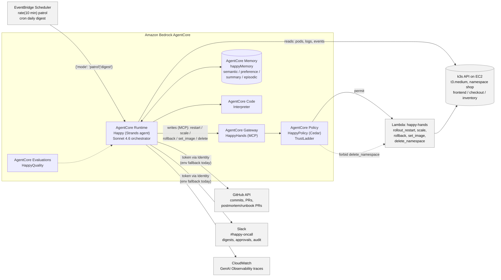

# Architecture

## Overview

A Strands agent, deployed on Amazon Bedrock AgentCore Runtime via the AgentCore CLI, is invoked
on a schedule by EventBridge Scheduler with a payload like `{"mode": "patrol"}`. It reads the
cluster directly through the Kubernetes API, but every write that touches the cluster goes
through an AgentCore Gateway (an MCP target backed by a Lambda) governed by an AgentCore Policy
engine evaluating Cedar rules. It reads git history from GitHub and talks to humans through
Slack. AgentCore Memory gives it recall across runs; the log-analysis specialist uses AgentCore
Code Interpreter. CloudWatch records every run as a trace and AgentCore Evaluations scores it.

Models: Claude Sonnet 4.6 (`us.anthropic.claude-sonnet-4-6`) is the orchestrator and the
investigation synthesizer. Claude Sonnet 4.5 (`global.anthropic.claude-sonnet-4-5-20250929-v1:0`)
runs the three parallel investigation specialists.



The same diagram is rendered as a PNG at `docs/architecture.png` (via `@mermaid-js/mermaid-cli`)
for anywhere Mermaid doesn't render, and is what the README embeds with
``.

## One incident, start to finish

The sequence below follows a single OOM incident on `checkout` through every layer: the
scheduled trigger, the read-only investigation, the fingerprint and ledger lookup, the
investigation Graph, the Slack approval gate, the write through the Gateway and Cedar policy
down to the Lambda and the cluster, the outcome recorded back into memory, and the postmortem
pull request that closes the loop.

```mermaid
sequenceDiagram
    autonumber
    participant SCH as EventBridge Scheduler
    participant RT as AgentCore Runtime (Happy)
    participant K8S as k3s API (namespace shop)
    participant FP as fingerprint.py
    participant LEDGER as Incident Ledger (AgentCore Memory)
    participant GRAPH as Investigation Graph
    participant SLACK as Slack (#happy-oncall)
    participant GW as AgentCore Gateway (HappyHands)
    participant POL as AgentCore Policy (Cedar)
    participant LAM as Lambda happy-hands
    participant GH as GitHub

    SCH->>RT: invoke {"mode": "patrol"}
    RT->>K8S: cluster_health()
    K8S-->>RT: checkout unhealthy (OOMKilled)
    RT->>K8S: get_pod_logs(checkout) / get_events(shop)
    RT->>FP: incident_fingerprint("checkout", "shop", "OOMKilled", logs)
    FP-->>RT: fingerprint id (stable across pod names/timestamps)
    RT->>LEDGER: recall_similar(fingerprint)
    LEDGER-->>RT: no match — first occurrence
    RT->>GRAPH: investigate(service="checkout", namespace="shop", fingerprint)
    Note over GRAPH: triage -> {logs_analyst, events_analyst, change_analyst}\nin parallel -> synthesizer
    GRAPH-->>RT: IncidentReport (root cause: PR #4 lowered memory limit;\nproposed_actions: rollback, tier=APPROVAL)
    RT->>SLACK: post_report(IncidentReport) in a new thread
    RT->>SLACK: "Approval needed [id]: rollback checkout. Reply approve <id> or deny <id> <reason>"
    Note over RT: tool_context.interrupt("approval", ...) — the run\nstops here; state persists via the session manager
    SLACK-->>RT: human replies "approve <id>"
    RT->>GW: rollback_deployment(name="checkout") via MCP
    GW->>POL: evaluate Hands___rollback_deployment
    POL-->>GW: permit
    GW->>LAM: invoke Lambda with tool args
    LAM->>K8S: PATCH deployment to previous revision's template
    K8S-->>LAM: ok
    LAM-->>RT: {"ok": true, "rolled_back_to_revision": ...}
    RT->>K8S: poll cluster_health() up to 5 minutes
    K8S-->>RT: checkout healthy
    RT->>LEDGER: record_outcome(record_id, action, succeeded=true, minutes_to_recover)
    RT->>LEDGER: remember_incident(fingerprint, summary, root_cause)
    LEDGER-->>RT: record_id (count incremented, not duplicated)
    RT->>GH: open_markdown_pr(postmortem branch, docs/postmortems/...)
    GH-->>RT: pull request URL
    RT->>SLACK: post postmortem PR link in the incident thread
```

If the same fingerprint fires again, step 5 (`recall_similar`) returns the existing record with
its successful outcome, and Happy skips straight to proposing that fix with the evidence from
last time — still through the same Slack approval step, still through the same Gateway and
Cedar check. After that fix has succeeded twice for one signature, an extra step opens a runbook
pull request alongside the postmortem one.

## Where policy actually lives

Two independent layers can stop a write, and only one of them is inside the model's control:

- **Inside the agent** — `guardrails.py::TIERS` classifies each write tool as `SAFE`,
  `APPROVAL`, or `FORBIDDEN`. For `APPROVAL` tools, `tools/hands.py` calls
  `tool_context.interrupt(...)` before the tool body runs, which is how Strands pauses the agent
  loop for a human reply. `PolicyHook` (a `BeforeToolCallEvent` hook) also blocks `FORBIDDEN`
  tools in-process, as a fallback for when the Gateway isn't reachable.
- **Outside the agent, at the Gateway** — the Cedar policies in `policies/` are evaluated by
  AgentCore Policy (`HappyPolicy`) on every MCP call the Gateway receives, regardless of what the
  model decided or what the in-process hook did. AgentCore requires exactly one statement per
  policy, so the trust ladder is three files: `01-forbid-delete-namespace.cedar`,
  `02-scale-cap.cedar`, and `03-permit-hands.cedar`. `scripts/render_policy.sh <gateway-arn>`
  substitutes the deployed Gateway's ARN into each file's `__GATEWAY_ARN__` placeholder (Cedar
  does not accept a wildcard resource), writes the results to `policies/rendered/`, and
  registers each one as its own policy on `HappyPolicy` via `agentcore add policy`.

The two layers overlap by design rather than one merely backstopping the other: `delete_namespace`
is refused both by the local hook and by the Gateway's `forbid`, and a scale request above 5
replicas is asked-for in Slack by the local interrupt while the Gateway's `when { replicas <= 5 }`
clause would still refuse to execute it even if a human said yes. See
[`docs/blog/02-trust-ladder.md`](blog/02-trust-ladder.md) for the reasoning behind keeping the
hard "no" outside the model entirely.
